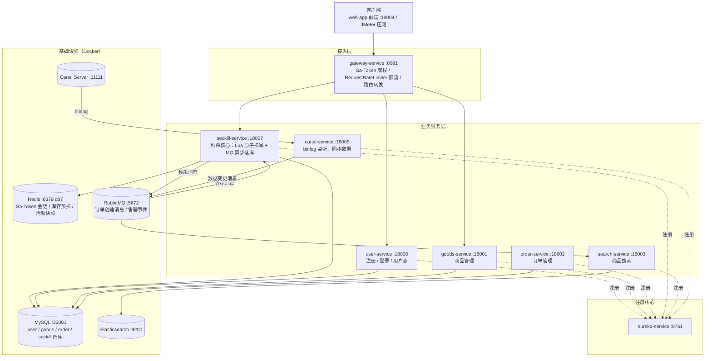

# flash-sale-system

基于 Spring Cloud 的分布式秒杀系统。

## 一、系统架构



### 服务清单

| 服务 | 端口 | 职责 |
|---|---|---|
| eureka-service | 8761 | 注册中心 |
| geteway-service | 8081 | 网关：统一鉴权、限流、路由 |
| user-service | 18006 | 用户注册登录、MD5+盐密码加密、Sa-Token 会话 |
| goods-service | 18001 | 商品管理 |
| order-service | 18002 | 订单管理 |
| seckill-service | 18007 | 秒杀核心：活动发布/预热、Lua 原子扣减、MQ 异步落库、一人一单 |
| search-service | 18003 | 基于 Elasticsearch 的商品搜索 |
| canal-service | 18005 | 监听 MySQL binlog，经 MQ 同步数据到 ES |
| web-app | 18004 | 静态前端 |

### 技术栈

Spring Boot 3 / Spring Cloud（Eureka + Gateway + OpenFeign）、MyBatis-Flex / Spring Data JPA、Sa-Token（Redis 共享会话）、Redis（Lua 脚本原子扣减）、RabbitMQ（异步落库 + 削峰）、Canal、Elasticsearch、JMeter（压测）。

## 二、如何启动项目

### 1. 启动基础设施（Docker）

| 容器名 | 用途 | 端口 | 备注 |
|---|---|---|---|
| flash-sale-system | MySQL | 33061 | root/root，含 user/goods/order/seckill 四库 |
| redis-stack | Redis + RedisInsight | 6379 / 8001 | 密码 Zheng#123，业务与 Sa-Token 会话统一用 db7 |
| rabbitmq | RabbitMQ + 管理台 | 5672 / 15672 | guest/guest，管理台 http://localhost:15672 |
| canal | Canal Server | 11111 | 监听 MySQL binlog |
| elasticsearch | Elasticsearch | 9200 | 搜索数据存储 |

容器已就绪的可跳过，需要手动创建时按上表端口映射即可。

### 2. 启动服务（IDEA 中按顺序 Run）

```text
① eureka-service     注册中心先起，其他服务都要注册到它
② goods-service      商品基础数据
③ user-service       用户服务（秒杀前需先登录拿 token）
④ seckill-service    秒杀核心服务
⑤ order-service      订单服务
⑥ canal-service      数据同步（可选）
⑦ search-service     搜索服务（可选）
⑧ geteway-service    网关最后起，聚合上面所有服务
⑨ web-app            静态前端（浏览器访问 http://localhost:18004）
```

### 3. 验证启动成功

```bash
# 注册中心：浏览器打开，能看到各服务实例
http://localhost:8761

# 网关连通性：秒杀列表（游客可访问）
curl http://localhost:8081/seckill/list
```

### 4. 秒杀链路（可选）

```bash
# 1) 发布秒杀活动（自动预热 Redis：库存计数器 + 活动快照 + 清已购集合）
curl -X POST "http://localhost:8081/seckill/publish?goodsId=<商品ID>&seckillPrice=100000&stock=10000"

# 2) 登录拿 token（表单参数，密码是 md5+固定盐的密文）
curl -X POST "http://localhost:8081/user/login/dologin" -d "mobile=13900000001" -d "password=d3b1294a61a07da9b49b6e22b2cbd7f9"

# 3) 携带 token 秒杀
curl -X POST "http://localhost:8081/seckill/do?goodsId=<商品ID>" -H "satoken: <上一步的token>"

# 4) 压测：运行 seckill-service 下的 GenUsers.java 批量生成用户与 token，
#    用 JMeter 读取 scripts/data/tokens.csv 压 /seckill/do
```
